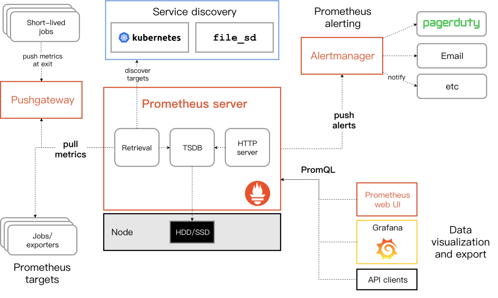

# Go 编程之语法

## 隐式实现的接口

**在 Go 中，一个类型只要实现了接口要求的所有函数，我们就说这个类型实现了该接口。** 这样带来的好处是：

1. 不用在设计接口的时候纠结到底这若干个函数要放在一个接口里还是分开好。
2. 实现不知有接口的存在，可以随时可以增加新的接口，而不用修改实现。

接口和实现从来没有如此松耦合过，实在令人振奋。Go 语言成功地打破了 Java 等面向对象语言固有的继承的思想，代之以一种灵活的非继承的实现。下面我们以 Java 为例子对比下这两种实现：

```java
public interface Animal {
    void watch();
    void eat();
}

public class Cat implements Animal{
    public void watch(){
        System.out.println("watch...");    
    }
    public void eat(){
        System.out.println("eat...");    
    }
}

public void main(String[] args){
    Animal a = new Cat();
    a.watch();
    a.eat();
}
```

```go
package main
import "fmt"

type Animal interface{
    watch()
    eat()
}

type Cat struct{}

func (c Cat) watch(){
    fmt.Println("watch...")
}

func (c Cat) eat(){
    fmt.Println("eat...")
}

func main(){
    a := Cat{}
    a.watch()
    a.eat()
}
```

有一天，我们发现不只有 Animal 会 watch，机器人（Robot）也会。对于 Java 我们可能需要这样的修改。

```java
public interface Watcher{
    void watch();
}
public interface Animal extends Watcher{
    void eat();
}

public class Robot implements Watcher{
    public void watch(){
        System.out.println("watch...");
    }
}
```

而在 Go 中，并不需要修改原来的接口，只需要新增 Watcher 接口即可，原先的 Cat 自动实现了 Watcher 接口。新增的接口对于原先的设计没有任何侵入性。

```go
type Watcher interface{
    watch()
}
type Robot struct{}
func (r Robot) watch(){
    fmt.Println("watch...")
}

func main(){
    w := Cat{}
    w.watch()
    w = Robot{}
    w.watch()
}
```

在使用 Go 的隐式接口实现时我们需要注意以下几点：

1. 我们只能对包内的类型实现新接口，而不能对包外的（特别是系统内置的）类型实现新接口；
2. 指针类型实现的接口与值类型实现的接口不同；
3. 接口是值，称之为接口值，可以进行传递，其值可视为有一个包含底层类型及其值的元组 `(type,value)` 组成；在上面的例子中，我们可以通过  `fmt.Printf("type:%T,\nvalue:%V \n",a,a)` 获知其底层类型和值。

## 晓畅整洁的代码

### 紧凑的声明赋值

`:=` 将变量声明和赋值操作符，是一个继承自 Newsqueak语言的写法，使得 Go 文法更加紧凑。

```go
a := "Hello"
// 等价于
var a string = "Hello"
```

### 惜字如金的可见性

学过 Java 的同学就知道，Java 中符号（此处的符号指常量名、变量名和函数名，下同）的可见性分为：public（公共可见）、private（类内可见）、protected（包内及子类可见） 和 package（包内可见）。这是从类型上分的，而 Go 只从包上分，只要定义为同一包，就可以相互可见，而要让符号包外可见，只需要让该符号首字母大写即可，首字母大写的符号即是可导出的符号，可导出的符号，包外就可见。Go 在可见性上甚至都没有定义描述符，可见其惜字如金的设计理念。

这项设计实际使用时并不美好，有时不想把文件内方法的私有方法暴露，只能再建一级文件，已达到隔离目的。

### 可别名的导入声明

导入声明（import declaration），用于导入外部的包进行引用。Java 中一样有类似的语句，不同的是，Go 中可以设定包别名。

```go
// 导入语句 及 调用方式
import "fmt" // fmt.Println
import f "fmt" // f.Println
import . "fmt" // Println
```

这样做有什么好处呢？试举一例，假定系统有一 Proxy 定义，APP 层级下也有两个 Proxy 定义。在同一个方法中出现了三种 Proxy，我们来看下 Java 和 Go 分别是怎么处理的。

```java
// Proxy.java
package com.system.internal;
public class Proxy{
    public String host;
    public int port;
    // ...
}
// Proxy.java
package com.app.web;
public class Proxy{
    public String host;
    public int port;
}
// Proxy.java
package com.app.internal;
public class Proxy{
    public String host;
    public Integer port;
    public Integer ttl;
}
// App.java
package com.app.web;
import com.app.helper.*;

public class App{
    private NetHelper helper;
    private Storager storager;

    public void doSth(Proxy p){
        helper.request(new com.system.internal.Proxy(p.host,p.port));
        storager.storage(new com.app.internal.Proxy(p.host,p.port,100));
    }
}
```

```go
// app/internal.go
package internal
type Proxy struct{
    host string
    port int
}
// system/internal.go
package net
type Proxy struct{
    host string
    port int
}
// app.go
package web
import aInternal "app/internal"
import sInternal "system/internal"
import . "app/helper"
type Proxy struct{
    host string
    port int
    ttl int
}
func DoSth(p Proxy) {
    Request(sInternal.Proxy{p.host,p.port})
    Storage(aInternal.Proxy{p.host,p.port,100})
}
```

由此可见，别名可以减少歧义，而不失简洁。

### 从左到右阅读的类型声明

Go 的设计者 Rob Pike 在谈及 [Go 声明语法](https://blog.golang.org/gos-declaration-syntax)时讲到：在 C语言家族之外的语言（比如 TypeScript），通常使用一个名字在前，类型后置的声明语法，就像这样（以下为虚构的语句）：

```text
x: int
p: pointer to int
a: array[3] of int
s: slice of int
```

Rob Pike 从中获取到灵感，去除了其中多余的符号，得到我们现在简洁而可以从左到右阅读（使用英文阅读）的声明语句：

```go
x int // 读作 x has the type int
p *int // 读作 p is a pointer to int
a [3]int // 读作 a is an array[3] of int
s []int // 读作 s is a slice of int
```

我们对比下 C 和 Java 中的表述：

```c
// C，不支持 slice
int x;
int *p;
int a[3];
```

C 在描述数组时，变量名和变量类型是交错的。

```java
// Java，不支持指针和slice
int x;
int[3] a;
```

Java 的声明语句是 Go 声明语句的倒序写法，即将 Java 中的声明语句从右向左写，就是 Go 的声明语句了。

### 语句收纳

同类语句可以使用圆括号进行收纳，使得 Go 文件更加整洁。

```go
// 导入语句收纳
import (
    "fmt"
    "math"
)
// 常量声明语句收纳
const (
    PI  = 3.14
    PHI = 1.618
)
// 变量声明语句收纳
var (
    a = "hello"
    b = "world"
)
```

### 瑞士军刀般的控制语句

Go 中的 for 和 switch 语句，犹如瑞士军刀，简单而多功能。

**（1）for 语句**

```go
// 功能：遍历 10 次
for i:=0;i<10;i++{
}
// 功能：类似于其他语言 while 的功能
var i = 0
for i<10{
}
// 功能：无限循环，类似于其他语言中的 while(true)
for{
}
```

**（2）switch 语句** Go 中的 switch 会自动 break，再也不用担心忘记在 case 后面写 break 了。如果不 break，需要在 case 后面写 fallthrough 语句。

```go
// 功能：选择颜色
switch color {
    case Red:
    // do something
    case Green:
    // do something
    default:
    // do something
}
// 功能：替代 if-then-else，更整齐
result := request()
switch {
    case result > 0:
    case result <0:
    default:
}
// 或者
switch result := request(); {
    case result > 0:
    case result <0:
    default:
}
```

### 命名返回值

在函数签名中命名返回值时会在函数开始时初始化相应的的变量，然后在不带任何参数的 return 语句执行时，自动返回对应变量的值。 命名返回值可以使得代码更易于阅读，并可用于生成文档。

```go
func add(left int, right int) (result int) {
    result = left + right
    return
}
```

### 智能的动态数组

（以下参考：[Go 切片：用法和本质](https://blog.go-zh.org/go-slices-usage-and-internals)） Go 中使用切片（slice）构建智能的动态数组。切片不存储任何数据，它只是描述了底层数组中的一段无长度的数组。 其结构如下，包括指向数组的指针，片段的长度，和容量（片段的最大长度）。



> 注意：底层数据仅在没有切片引用时才会被回收，因此当返回底层数组中的一小段时建议拷贝一段返回。

```go
// 使用 make 创建一个 len 为 5，cap 为 10，底层类型为 []byte 的切片
s := make([]byte, 5, 10)
len(s) == 5
cap(s) == 10
// 基于现有数组生成切片
b := []byte{'g', 'o', 'l', 'a', 'n', 'g'}
b[:2] == []byte{'g', 'o'}
b[2:] == []byte{'l', 'a', 'n', 'g'}
b[:] == b
```

### 复制切片

```go
// 复制切片函数签名
func copy(dst, src []T) int
// 复制切片
t := make([]byte, len(s), (cap(s)+1)*2)
copy(t, s)
s = t
```

### 追加元素

追加元素时，如果容量不够，会导致底层数组扩容。

```go
// 追加元素函数签名
func append(s []T, x ...T) []T
// 追加元素
a := make([]int, 1)
// a == []int{0}
a = append(a, 1, 2, 3)
// a == []int{0, 1, 2, 3}
```

## 空接口

**指定了零个方法的接口值称之为空接口**。

```go
interface{}
```

空接口可保存任何类型的值，因为每个类型都至少实现了零个方法。 空接口可以用来处理未知类型的值。

```go
func main() {
    var unknown interface{}
    unknown = 100
    log(unknown)
    unknown = "unknown"
    log(unknown)
}

func log(i interface{}) {
    fmt.Println(i)
}
```

## 类型断言

类型断言是访问接口值底层值具体值的方式。

```go
t := i.(T) // 断言接口值 i 保存了具体类型 T，并将 T 的值赋值到变量 t
t, ok := i.(T) // ok，断言是否成功的布尔值，确保了在 i 并不保存类型值 T 时不报错（panic）
```

在上面的例子中，我们可以扩展

```go
func log(i interface{}) {
    if _, ok := i.(string); ok {
        fmt.Printf("string: %s\n", i)
    } else if _, ok = i.(int); ok {
        fmt.Printf("int: %s\n", i)
    } else {
        fmt.Println(i)
    }
}
```

其实，使用类型选择语句可以简化上述的流程：

```go
func log(i interface{}) {
    switch t := i.(type) {
    case int:
        fmt.Printf("int: %d\n", t)
    case string:
        fmt.Printf("string: %s\n", t)
    default:
        fmt.Printf(t)
    }
}
```

## 优雅的异常处理

### 多个返回值的函数

Go 中的函数可以返回多个返回值，通常我们使用最后一个返回值来标识错误。 Go 中的错误接口定义如下：

```go
type error interface {
    Error() string
}
```

当发生错误时，error!=nil，否则为 nil。

下面的例子展示了除 0 错误的处理：

```go
type DivideZeroError struct {
    Left, Right float64
}

func (e DivideZeroError) Error() string {
    return fmt.Sprintf("Can not divide zero! %f/%f", e.Left, e.Right)
}

func divide(left float64, right float64) (float64, error) {
    if right == 0 {
        return 0, DivideZeroError{left, right}
    }
    return left / right, nil
}

func main() {
    fmt.Println(divide(121, 11))
    fmt.Println(divide(33, 0))
}
```

### 立即求值延迟调用的defer

defer 是一个神奇的修饰符，它可以使得被修饰的语句立即求值，然后等到函数返回时再执行。当函数中有多个 defer 语句时，按照后进先出规则依次执行。 这个特性有什么用呢？ 一切我们在函数执行完毕之后必须执行的操作都可以交给 defer，比如关闭资源、释放锁等操作，而不用像 Java 那样一连串的 try-catch-finally 了。

```go
import (
    "log"
    "os"
)

func main() {
    f, err := os.Open("main.go")
    if err != nil {
        log.Println("Open file failed:", err)
        return
    }
    defer f.Close() // 妈妈再也不用担心我忘记关闭资源了
    buf := make([]byte, 1024)
    for {
        n, _ := f.Read(buf)
        if 0 == n {
            break
        }
        os.Stdout.Write(buf[:n])
    }
}
```

### panic 和 recover

Go 语言中错误被认为是可预期的结果，而异常则是不可预期的。 panic 支持抛出任意类型的异常，其函数签名为：

```go
func panic(interface{})
```

recover 函数用于捕获异常，其函数签名为：

```go
func recover() interface{}
```

必须要和有异常的栈帧只隔一个栈帧， recover 函数才能正常捕获异常。换言之， recover 函数捕获的是祖父一级调用函数栈帧的异常（刚好可以跨越一层 defer 函数） 示例：

```go
func main() {
    defer func() {
        if r := recover(); r != nil {
            fmt.Println(r)
        }
    }()
    panic("WTF")
}
```

异常的处理：

1. 转为 error。即使在包内部使用了 panic ，但在导出时要转化为明确的错误值。
2. 在处理错误返回值时，没有错误的情况直接返回 nil。

## 零值

布尔类型的零值是 false，数值类型的零值是 0，字符串类型的零值是 ""，指针（pointer）、通道（channel）、函数（func）、接口（interface）、映射（map）或切片（slice）类型的零值是 nil。

`nil` 是预声明的内建标识符，但不是关键字。 关于 nil 有几个注意点：

1. 结构体（struct）的零值非 nil，而是跟其属性有关；
2. nil 没有默认值，没有默认类型；
3. 所有类型的 nil 值内存地址相同都是 0x0，但是大小依类型而不同；
4. 不同类型的 nil 值不可比较；
5. 同一类型的 nil 值也不一定可以比较，比如都为 map、slice 或 func的零值就不可比较，因为这些类型是不可比拟的类型。

以下内容参考：[GopherCon 2016: Francesc Campoy - Understanding nil](https://www.youtube.com/watch?v=ynoY2xz-F8s)

### nil pointer

nil pointer 的方法和属性是可调用的。

```go
type tree struct {
  v int
  l *tree
  r *tree
}
func (t *tree) Find(v int) bool {
  if t == nil {
    return false
  }
  return t.v == v || t.l.Find(v) || t.r.Find(v)
}
```

### nil channel

nil channel 可读取可写入，但是不可关闭，关闭会抛出 panic。

```go
var c chan t
// 读取但永远阻塞
<- c 
// 写入但永远阻塞
c <- x
// ! 禁止关闭，会抛出 panic: close of nil channel
close(c)
```

### nil func

nil func 不可调用。

```go
func get() func() {
    return func() {
        fmt.Println("2333")
    }
}

func call(f func()) {
    f()
}

func main() {
    var f func()
    f = get()
    call(f)
    f = nil
    call(f) // panic: runtime error: invalid memory address or nil pointer dereference
}
```

### nil interface

接口值为零值和接口值的底层值为零值是不同的；当接口值为 nil 时底层值和底层值类型皆为零值；当接口值的底层值为零值时，可能其底层值类型不为零值。当接口值的底层值类型不为零值而底层值为零值时，仍然可以触发函数调用，所以我们需要在实现中判定接收者是否为零值。这种情况下，Java 会抛出 NullPointerException 而不会触发函数调用，我们举例来说明这点：

```java
Cat c = null;
Animal a = c;
a.watch(); // NPE
```

```go
func (c Cat) watch() {
    if c == (Cat{}) {
        fmt.Println("zero cat cannot watch")
        return
    }
    fmt.Println("watch...")
}

func main(){
    var a Animal
    var c Cat // nil cat
    a = c
    a.watch()
}
```

不抛出空指针异常，而是将其内聚化进行处理，这才是优雅之道。

### nil map

nil map 可视为一个只读的没有键值的 map，对于这样的 map 支持以下操作

```go
func main() {
    var m map[int]string
    // 遍历
    for k, v := range m {
    }
    // 获取长度
    len(m)
    // 取值
    v, ok := m[0]
    // ！不允许赋值，会抛出 panic
    m[0] = "hello"
}
```

### nil slice

nil slice 可以视为一个只读的长度为0，容量为0的 slice，对于这样的 slice 支持以下操作

```go
var s []slice
// 获取长度，为 0
len(s)
// 获取容量，为 0
cap(s)
// 遍历 0 次
for range s
// 追加元素 v
s = append(s, v)
// ! 不允许赋值，抛出 panic: index out of range
s[i]
```

## 常量计数器 iota

iota 只能在常量表达式中使用，用于常量计数。iota 会在 const 关键字出现时重置为 0，const 块中每增加一行常量声明就会使 iota 自增 1。下面列举 iota 的使用场景。 以下参考：[iota: Elegant Constants in Golang](https://splice.com/blog/iota-elegant-constants-golang/)

### 自定义枚举类型

```go
type Weekday int

const (
    Sunday Weekday = iota // 0
    Monday              // 1
    Tuesday             // 2
    Wednesday           // 3
    Thursday            // 4
    Friday              // 5
    Saturday            // 6
)
```

### 跳过自增值

使用 `_` 可以跳过不想要的值。

```go
type AudioOutput int

const ( 
    OutMute AudioOutput = iota // 0 
    OutMono                    // 1 
    OutStereo                  // 2 
    _ 
    _ 
    OutSurround                // 5 
)
```

### 位掩码表达式

事实上，Go 解析器会取得包含 iota 的表达式，并应用到接下来的语句中。

```go
type ByteSize float64

const (
    _           = iota                   // ignore first value by assigning to blank identifier
    KB ByteSize = 1 << (10 * iota) // 1 << (10*1)
    MB                                   // 1 << (10*2)
    GB                                   // 1 << (10*3)
    TB                                   // 1 << (10*4)
    PB                                   // 1 << (10*5)
    EB                                   // 1 << (10*6)
    ZB                                   // 1 << (10*7)
    YB                                   // 1 << (10*8)
)
```

## 自定义打印值

fmt 包定义了 Stringer 接口，用来打印值。我们可以通过实现 Stringer 接口，来自定义打印值。

```go
type Stringer interface {
    String() string
}
```

```go
type Person struct {
    Name string
    Age  int
}
func (p Person) String() string {
    return fmt.Sprintf("%v (%v years)", p.Name, p.Age)
}
```

